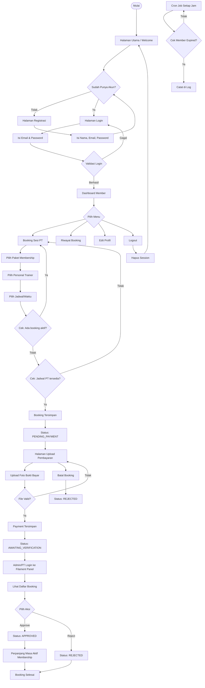

# GymFit App

Sistem Manajemen Booking Gym & Membership berbasis **Laravel 13** dengan **Filament Admin Panel**.

## Fitur

- **Manajemen User & Role** — Admin, Personal Trainer (PT), Member via Spatie Permission
- **Manajemen Membership Plan** — CRUD paket membership dengan harga dan durasi
- **Booking Sesi PT** — Pilih paket, PT, dan jadwal dengan proteksi double booking
- **Pembayaran & Verifikasi** — Upload bukti bayar, diverifikasi Admin/PT via Filament Panel
- **Cron Job** — Pengecekan otomatis membership expired tiap jam
- **Filament Admin Panel** — Kelola booking, user, dan membership plan

## Teknologi

| Teknologi | Versi | Kegunaan |
|-----------|:-----:|----------|
| Laravel | 13.x | Framework PHP utama |
| Filament | 3.x | Admin panel |
| MariaDB | 10.x | Database |
| Tailwind CSS | 4.x | Styling UI |
| Vite | 6.x | Asset bundler |
| Alpine.js | 3.x | Interaktivitas frontend |
| Spatie Permission | 6.x | Manajemen role & permission |

## Status Booking

| Status | Keterangan |
|--------|-----------|
| `PENDING_PAYMENT` | Menunggu pembayaran |
| `AWAITING_VERIFICATION` | Bukti bayar diupload, menunggu verifikasi |
| `APPROVED` | Booking disetujui |
| `REJECTED` | Booking ditolak/dibatalkan |
| `COMPLETED` | Sesi selesai |
| `EXPIRED` | Booking kadaluarsa |

## User Roles & Hak Akses

| Fitur | Admin | PT | Member | Guest |
|:------|:-----:|:--:|:------:|:-----:|
| Registrasi & Login | ✅ | ✅ | ✅ | ✅ |
| Dashboard Member | ✅ | ✅ | ✅ | ❌ |
| Booking Sesi PT | ❌ | ❌ | ✅ | ❌ |
| Upload Pembayaran | ❌ | ❌ | ✅ | ❌ |
| Filament Admin Panel | ✅ | ✅ | ❌ | ❌ |
| Kelola User (CRUD) | ✅ | ❌ | ❌ | ❌ |
| Kelola Membership Plan | ✅ | ❌ | ❌ | ❌ |
| Verifikasi Pembayaran | ✅ | ✅ | ❌ | ❌ |

## Flowchart Aplikasi



## Struktur Database

```
users ──┬── bookings (member_id)
         └── bookings (pt_id)
membership_plans ──┬── bookings
                    └── users
bookings ──── payments
```

Relasi: Satu member bisa punya banyak booking, satu PT bisa menangani banyak booking, satu booking punya satu pembayaran.

## Deployment

**URL:** [https://gymfit.my.id](https://gymfit.my.id)

**Akun Login (Seeder):**

| Role | Email | Password |
|:----|:------|:--------:|
| Admin | `admin@gymfit.com` | `password` |
| Trainer | `trainer@gymfit.com` | `password` |
| Member | `agung@student.com` | `password` |

**Menjalankan Lokal:**
```bash
cd gymfit-app
composer install
cp .env.example .env
php artisan key:generate
php artisan migrate --seed
php artisan serve
```
