# 📋 LAPORAN PROJEK APLIKASI GYMFIT
## Sistem Manajemen Booking Gym & Membership

---

## 1. PENDAHULUAN

### 1.1 Latar Belakang
GymFit adalah aplikasi berbasis web untuk manajemen gym yang menangani pendaftaran membership, booking sesi dengan Personal Trainer (PT), serta verifikasi pembayaran. Aplikasi ini dibangun menggunakan framework **Laravel** dengan **Filament Admin Panel** untuk memudahkan pengelolaan data oleh admin.

### 1.2 Tujuan
- Memudahkan member dalam mendaftar membership dan booking PT
- Mempermudah admin dalam memverifikasi pembayaran dan mengelola data
- Menyediakan sistem cron untuk pengecekan membership yang expired

### 1.3 Teknologi yang Digunakan

| Teknologi | Versi | Kegunaan |
|-----------|:-----:|----------|
| **Laravel** | 13.x | Framework PHP utama |
| **Filament** | 3.x | Admin panel |
| **SQLite** | - | Database lokal |
| **Tailwind CSS** | 4.x | Styling UI |
| **Vite** | 6.x | Asset bundler |
| **Alpine.js** | 3.x | Interaktivitas frontend |
| **Spatie Permission** | 6.x | Manajemen role & permission |
| **Carbon** | - | Manipulasi tanggal |

---

## 2. FITUR-FITUR APLIKASI

### 2.1 Manajemen User & Role
- **3 Role**: Admin, Personal Trainer (PT), dan Member
- Registrasi & autentikasi user
- Manajemen profil (edit, update password, hapus akun)
- Verifikasi email
- Reset password

### 2.2 Manajemen Membership Plan
- CRUD paket membership (Admin)
- Set harga, durasi (hari), dan status aktif/non-aktif
- Tampilan daftar paket untuk member

### 2.3 Booking Sesi dengan PT
- Member memilih paket membership
- Member memilih Personal Trainer (PT)
- Member memilih jadwal sesi
- **Cegah double booking**: PT tidak bisa di-booking di jam yang sama
- **Cegah booking ganda**: Member tidak bisa booking jika masih punya booking aktif

### 2.4 Pembayaran & Verifikasi
- Upload bukti pembayaran (foto/scan)
- Status pembayaran: `PENDING` → `VERIFIED`
- Verifikasi oleh Admin/PT via Filament Panel
- Perpanjangan otomatis masa aktif membership setelah verifikasi

### 2.5 Status Booking
Booking memiliki beberapa status:

| Status | Keterangan |
|--------|-----------|
| `PENDING_PAYMENT` | Menunggu pembayaran dari member |
| `AWAITING_VERIFICATION` | Bukti bayar sudah diupload, menunggu verifikasi |
| `APPROVED` | Booking disetujui |
| `REJECTED` | Booking ditolak/dibatalkan |
| `COMPLETED` | Sesi selesai |
| `EXPIRED` | Booking kadaluarsa |

### 2.6 Cron Job - Cek Membership Expired
- Sistem cron mengecek membership yang expired setiap jam
- Member dengan masa aktif habis akan tercatat di log

### 2.7 Filament Admin Panel
- Dashboard admin untuk mengelola:
  - Data **Booking** (approve/reject)
  - Data **User** (CRUD)
  - **Membership Plan** (CRUD)
- Hanya Admin & PT yang bisa akses panel

---

## 3. STRUKTUR DATABASE

### 3.1 Entity Relationship Diagram (ERD)

```
┌──────────────────┐       ┌──────────────────────┐
│      users       │       │  membership_plans    │
├──────────────────┤       ├──────────────────────┤
│ PK │ id          │──┐    │ PK │ id              │
│    │ name        │  │    │    │ name            │
│    │ email       │  │    │    │ description     │
│    │ password    │  │    │    │ price           │
│    │ phone       │  │    │    │ duration_days   │
│    │ membership_ │  ├────┤    │ is_active       │
│    │  plan_id    │  │    │    │ created_at      │
│    │ membership_ │  │    │    │ updated_at      │
│    │ expires_at  │  │    └──────┘               │
│    │ created_at  │  │                            │
│    │ updated_at  │  │                            │
└──────────────────┘  │       ┌──────────────────────┐
                      │       │      bookings        │
                      │       ├──────────────────────┤
                      └───────│ PK │ id              │
                              │ FK │ member_id       │
              ┌───────────────│ FK │ pt_id           │
              │               │ FK │ membership_     │
              │               │    │  plan_id        │
              │               │    │ schedule_time   │
              │               │    │ status          │
              │               │    │ member_notes    │
              │               │    │ pt_notes        │
              │               │    │ amount          │
              │               │    │ created_at      │
              │               │    │ updated_at      │
              │               │    │ deleted_at      │
              │               └──────┬───────────────┘
              │                      │
              │    ┌─────────────────┘
              │    │
              │    │   ┌──────────────────────┐
              │    │   │      payments        │
              │    │   ├──────────────────────┤
              │    └───│ FK │ booking_id      │
              │        │    │ amount          │
              │        │    │ proof_path      │
              │        │    │ status          │
              │        │    │ verified_by    │
              │        │    │ verified_at     │
              │        │    │ created_at      │
              │        │    │ updated_at      │
              │        └──────────────────────┘
              │
    ┌─────────┴──────────────────────────────────────┐
    │              Tabel Spatie                      │
    ├────────────────────────────────────────────────┤
    │ roles, permissions, model_has_roles,           │
    │ model_has_permissions, role_has_permissions     │
    └────────────────────────────────────────────────┘
```

### 3.2 Relasi Antar Tabel

| Relasi | Dari | Ke | Keterangan |
|--------|------|----|-----------|
| Member → Booking | `users.id` | `bookings.member_id` | Satu member bisa punya banyak booking |
| PT → Booking | `users.id` | `bookings.pt_id` | Satu PT bisa menangani banyak booking |
| Plan → Booking | `membership_plans.id` | `bookings.membership_plan_id` | Satu plan bisa dipakai banyak booking |
| Plan → User | `membership_plans.id` | `users.membership_plan_id` | Satu plan bisa dimiliki banyak user |
| Booking → Payment | `bookings.id` | `payments.booking_id` | Satu booking punya satu pembayaran |

---

## 4. FLOWCHART ALUR KERJA APLIKASI

```mermaid
flowchart TD
    Start([Mulai]) --> Home[Halaman Utama / Welcome]
    Home --> Login{Sudah Punya Akun?}
    
    Login -- Tidak --> Register[Halaman Registrasi]
    Register --> RegForm[Isi Nama, Email, Password]
    RegForm --> Login
    
    Login -- Ya --> LoginForm[Halaman Login]
    LoginForm --> InputLogin[Isi Email & Password]
    InputLogin --> Auth{Validasi Login}
    Auth -- Gagal --> LoginForm
    Auth -- Berhasil --> Dashboard[Dashboard Member]
    
    %% Dashboard Member
    Dashboard --> PilihMenu{Pilih Menu}
    PilihMenu --> BookingPT[Booking Sesi PT]
    PilihMenu --> Riwayat[Riwayat Booking]
    PilihMenu --> Profile[Edit Profil]
    PilihMenu --> Logout[Logout]
    
    %% Alur Booking
    BookingPT --> PilihPlan[Pilih Paket Membership]
    PilihPlan --> PilihPT[Pilih Personal Trainer]
    PilihPT --> PilihJadwal[Pilih Jadwal/Waktu]
    PilihJadwal --> CekBooking{Cek: Ada booking aktif?}
    
    CekBooking -- Ya --> BookingPT
    CekBooking -- Tidak --> CekJadwal{Cek: Jadwal PT tersedia?}
    
    CekJadwal -- Tidak --> BookingPT
    CekJadwal -- Ya --> SimpanBooking[Booking Tersimpan]
    SimpanBooking --> StatusPending[Status: PENDING_PAYMENT]
    
    %% Pembayaran
    StatusPending --> UploadBayar[Halaman Upload Pembayaran]
    UploadBayar --> UploadBukti[Upload Foto Bukti Bayar]
    UploadBukti --> ValidasiUpload{File Valid?<br/>jpg/jpeg/png, max 5MB}
    ValidasiUpload -- Tidak --> UploadBayar
    ValidasiUpload -- Ya --> SimpanPayment[Payment Tersimpan]
    SimpanPayment --> StatusAwait[Status: AWAITING_VERIFICATION]
    
    %% Verifikasi Admin
    StatusAwait --> NotifAdmin[Notifikasi ke Admin/PT]
    NotifAdmin --> AdminPanel[Admin/PT Login ke Filament Panel]
    AdminPanel --> LihatBooking[Lihat Daftar Booking]
    LihatBooking --> VerifPilih{Pilih Aksi}
    
    VerifPilih -- Approve --> ApproveBooking[Status: APPROVED]
    ApproveBooking --> PerpanjangMember[Perpanjang Masa Aktif Membership]
    PerpanjangMember --> SelesaiBooking[Booking Selesai]
    
    VerifPilih -- Reject --> RejectBooking[Status: REJECTED]
    RejectBooking --> SelesaiBooking
    
    %% Alur Cancel
    UploadBayar --> BatalBooking[Batal Booking]
    BatalBooking --> StatusReject[Status: REJECTED]
    
    %% Alur Expired
    CronJob[Cron Job Setiap Jam] --> CekExpired{Cek Member Expired?}
    CekExpired -- Ya --> CatatLog[Catat di Log & Kirim Notif]
    CekExpired -- Tidak --> CronJob
    
    %% Alur Logout
    Logout --> LogoutProses[Hapus Session]
    LogoutProses --> Home
    
    %% Styling
    classDef process fill:#e1f5fe,stroke:#0288d1,stroke-width:2px;
    classDef decision fill:#fff3e0,stroke:#f57c00,stroke-width:2px;
    classDef start fill:#e8f5e9,stroke:#388e3c,stroke-width:2px;
    classDef admin fill:#f3e5f5,stroke:#7b1fa2,stroke-width:2px;
    classDef payment fill:#fff8e1,stroke:#f9a825,stroke-width:2px;
    
    class Start,Home,LoginForm,Register,Dashboard start;
    class Login,Auth,PilihMenu,CekBooking,CekJadwal,ValidasiUpload,VerifPilih,CekExpired decision;
    class BookingPT,PilihPlan,PilihPT,PilihJadwal,SimpanBooking,UploadBayar,UploadBukti,SimpanPayment process;
    class AdminPanel,LihatBooking,ApproveBooking,RejectBooking admin;
    class StatusPending,StatusAwait payment;
    class CronJob process;
```



---

## 5. FLOWCHART ALUR KERJA (TEKS)

### Alur Member Booking Sesi PT

```
                          ┌──────────────┐
                          │  Halaman Awal │
                          └──────┬───────┘
                                 │
                                 ▼
                          ┌──────────────┐
                 ┌────────│ Login/Regist │────────┐
                 │        └──────┬───────┘        │
                 ▼               ▼                 ▼
          ┌──────────┐    ┌────────────┐    ┌──────────┐
          │ Register │───▶│  Dashboard │◀───│  Login   │
          └──────────┘    └──────┬─────┘    └──────────┘
                                 │
                    ┌────────────┼────────────┐
                    ▼            ▼            ▼
             ┌──────────┐ ┌──────────┐ ┌──────────┐
             │  Booking │ │ Riwayat  │ │  Profil  │
             └────┬─────┘ └──────────┘ └──────────┘
                  │
          ┌───────┴───────┐
          ▼               ▼
   ┌──────────┐    ┌──────────┐
   │ Pilih    │    │ Pilih    │
   │ Paket    │───▶│ PT       │
   └──────────┘    └────┬─────┘
                        │
                        ▼
                  ┌──────────┐
                  │ Pilih    │
                  │ Jadwal   │
                  └────┬─────┘
                       │
                ┌──────┴──────┐
                ▼             ▼
         ┌──────────┐  ┌──────────┐
         │ Booking  │  │ Upload   │
         │ Tersimpan│─▶│ Bukti    │
         │ (Pending │  │ Bayar    │
         │ Payment) │  └────┬─────┘
         └──────────┘       │
                            ▼
                    ┌──────────────┐
                    │  Menunggu    │
                    │  Verifikasi  │
                    │  Admin/PT    │
                    └──────┬───────┘
                           │
                    ┌──────┴──────┐
                    ▼             ▼
             ┌──────────┐ ┌──────────┐
             │ APPROVED │ │ REJECTED │
             │ + Aktif   │ │ Booking  │
             │ Membershp │ │ Gagal    │
             └──────────┘ └──────────┘
```

---

## 6. USER ROLES & HAK AKSES

| Fitur | Admin | PT (Trainer) | Member | Guest |
|:------|:-----:|:------------:|:------:|:-----:|
| Registrasi & Login | ✅ | ✅ | ✅ | ✅ |
| Melihat Halaman Welcome | ✅ | ✅ | ✅ | ✅ |
| Dashboard Member | ✅ | ✅ | ✅ | ❌ |
| Booking Sesi PT | ❌ | ❌ | ✅ | ❌ |
| Upload Bukti Pembayaran | ❌ | ❌ | ✅ | ❌ |
| Batalkan Booking | ❌ | ❌ | ✅ | ❌ |
| Edit Profil | ✅ | ✅ | ✅ | ❌ |
| Filament Admin Panel | ✅ | ✅ | ❌ | ❌ |
| Kelola User (CRUD) | ✅ | ❌ | ❌ | ❌ |
| Kelola Membership Plan | ✅ | ❌ | ❌ | ❌ |
| Verifikasi Pembayaran | ✅ | ✅ | ❌ | ❌ |
| Approve/Reject Booking | ✅ | ✅ | ❌ | ❌ |

---

## 7. STRUKTUR FILE PROYEK

```
gymfit-app/
├── app/
│   ├── Console/Commands/
│   │   └── CheckExpiredMemberships.php   # Cron command
│   ├── Filament/Resources/
│   │   ├── BookingResource.php           # Admin panel booking
│   │   ├── MembershipPlanResource.php    # Admin panel plan
│   │   └── UserResource.php             # Admin panel user
│   ├── Http/Controllers/
│   │   ├── Auth/                         # Auth controllers
│   │   ├── Member/
│   │   │   ├── BookingController.php     # Booking logic
│   │   │   └── DashboardController.php   # Dashboard
│   │   ├── ProfileController.php         # Profile management
│   │   └── Controller.php
│   ├── Models/
│   │   ├── Booking.php                   # Model booking
│   │   ├── MembershipPlan.php            # Model paket
│   │   ├── Payment.php                   # Model pembayaran
│   │   └── User.php                      # Model user
│   ├── Services/
│   │   ├── BookingService.php            # Service booking
│   │   ├── CronJobService.php            # Service cron
│   │   └── PaymentVerificationService.php # Service verifikasi
│   └── Providers/
├── config/                               # Konfigurasi
├── database/
│   ├── migrations/                        # Migrasi database
│   ├── seeders/                           # Data awal (seeder)
│   └── database.sqlite                    # Database SQLite
├── resources/views/
│   ├── auth/                              # View login/register
│   ├── bookings/
│   │   ├── create.blade.php               # Form booking
│   │   └── payment.blade.php              # Upload pembayaran
│   ├── layouts/                           # Layout template
│   ├── profile/                           # Halaman profil
│   ├── components/                        # Komponen UI
│   ├── dashboard.blade.php                # Dashboard member
│   └── welcome.blade.php                  # Halaman utama
├── routes/
│   ├── web.php                            # Route utama
│   ├── auth.php                           # Route auth
│   └── console.php                        # Route cron
└── .env                                   # Environment config
```

---

## 8. SKEMA STATUS

### Status Booking
```
PENDING_PAYMENT ──▶ AWAITING_VERIFICATION ──▶ APPROVED ──▶ COMPLETED
       │                      │                      │
       │                      ├──▶ REJECTED          │
       │                      │                      │
       └──▶ REJECTED (Cancel) └──▶ EXPIRED           │
                                                      │
                                               [Membership Diperpanjang]
```

### Status Payment
```
PENDING ──▶ VERIFIED
              │
         [Membership 
          Diperpanjang]
```

---

## 9. DEPLOYMENT & AKSES

### URL Online (Serveo Tunnel)
```
🌐 https://72608f3ce5003448-114-10-6-184.serveousercontent.com
```

### Akun Login (Data Seeder)

| Role | Email | Password |
|:----|:------|:--------:|
| **Admin** | `admin@gymfit.com` | `password` |
| **Trainer** | `trainer@gymfit.com` | `password` |
| **Member** | `agung@student.com` | `password` |

### Cara Menjalankan Lokal
```bash
cd gymfit-app
cp .env.example .env    # Atau pakai .env yang sudah ada
php artisan serve       # Jalan di http://localhost:8000
```

---

## 10. KESIMPULAN

Aplikasi **GymFit** berhasil dikembangkan menggunakan **Laravel 13** dengan **Filament Admin Panel**. Aplikasi ini mencakup:

1. ✅ **Autentikasi** — Register, login, verifikasi email, reset password
2. ✅ **Manajemen Role** — Admin, PT, Member via Spatie Permission
3. ✅ **Booking PT** — Pilih paket, PT, dan jadwal dengan proteksi double booking
4. ✅ **Pembayaran** — Upload bukti bayar dengan verifikasi admin
5. ✅ **Admin Panel** — Filament untuk kelola user, booking, dan plan
6. ✅ **Cron Job** — Pengecekan membership expired otomatis
7. ✅ **Deployment** — Online via Serveo Tunnel (https://...serveousercontent.com)

---

*Laporan ini dibuat otomatis oleh AI Assistant — GymFit App*
*2026*
